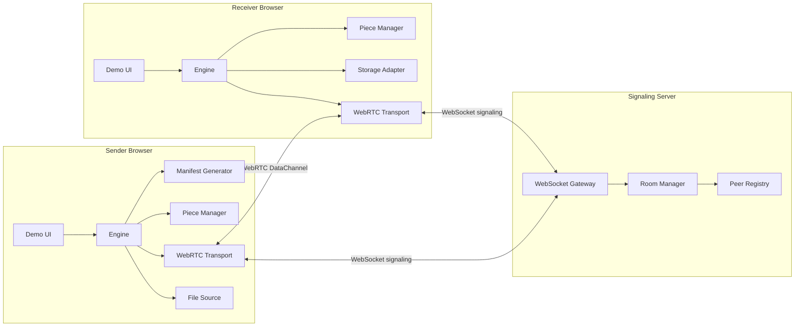
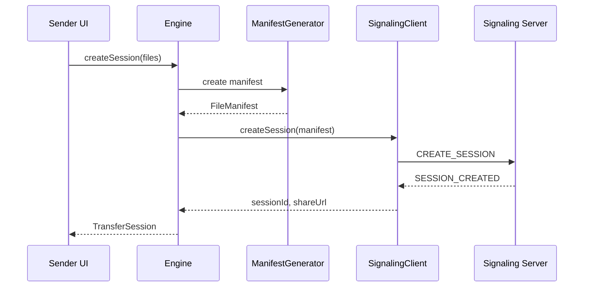
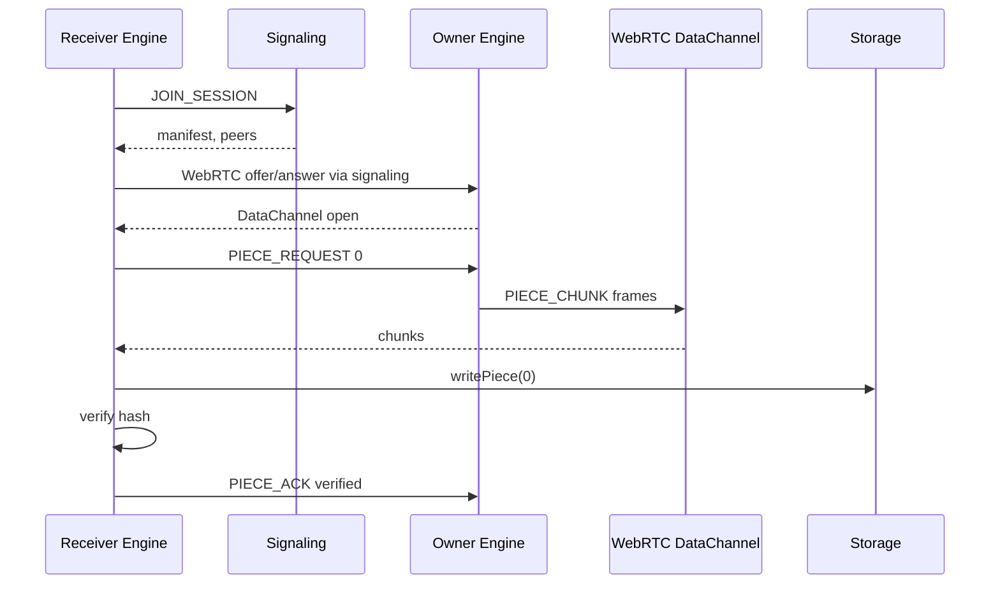
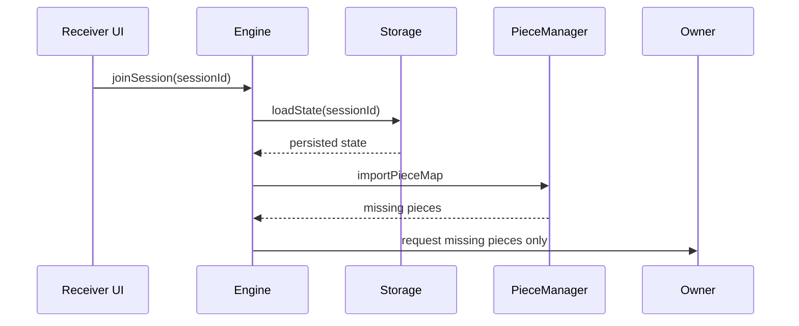

# PonsWarp Grid Engine SDD

Software Design Document  
문서 버전: v0.1  
작성일: 2026-06-30

---

## 1. 설계 목표

PonsWarp Grid Engine은 기존 PonsWarp의 파일 전송 기능을 다음 구조로 분리한다.

```text
App UI
  ↓
Engine API
  ↓
Core domain modules
  ↓
Transport abstraction
  ↓
WebRTC DataChannel
```

설계 목표는 다음이다.

1. Core는 UI framework에 의존하지 않는다.
2. Core는 WebRTC 구현 세부사항에 직접 의존하지 않는다.
3. WebRTC transport는 독립적으로 테스트 가능해야 한다.
4. Storage는 OPFS, IndexedDB, Memory adapter로 교체 가능해야 한다.
5. v1은 owner 중심 전송을 구현하되, v1.5 grid scheduler로 확장 가능한 구조를 가진다.

---

## 2. 전체 아키텍처



---

## 3. Repository 구조

권장 구조:

```text
ponswarp-grid
  package.json
  pnpm-workspace.yaml
  README.md
  LICENSE
  CONTRIBUTING.md
  SECURITY.md

  packages
    core
      src
        index.ts
        engine
        manifest
        piece-manager
        storage
        integrity
        scheduler
        events
        protocol
        types
      test

    webrtc
      src
        index.ts
        peer-connection
        data-channel
        signaling-client
        transport
      test

    signaling
      src
        index.ts
        server.ts
        room-manager.ts
        peer-registry.ts
        types.ts
      test

    react
      src
        usePonsWarp.ts
        PonsWarpProvider.tsx

  apps
    demo
      src
        pages
        components
        lib

  docs
    prd.md
    srs.md
    architecture.md
    protocol.md
    test-plan.md
```

---

## 4. 패키지 책임

| 패키지 | 책임 | 의존 가능 대상 | 의존 금지 대상 |
|---|---|---|---|
| `@ponswarp/core` | manifest, piece, storage, scheduler, events | 표준 Web API 일부 | React, WebRTC concrete class |
| `@ponswarp/webrtc` | WebRTC DataChannel transport | `core` types | React UI |
| `@ponswarp/signaling` | signaling server | Node.js, WebSocket | browser UI |
| `@ponswarp/react` | React hook wrapper | `core`, `webrtc` | signaling server 내부 |
| `apps/demo` | 대회 시연 UI | 모든 public package | private internals |

---

## 5. Core 모듈 설계

## 5.1 Engine

Engine은 public API의 진입점이다.

```ts
interface PonsWarpEngine {
  createSession(input: CreateSessionInput): Promise<TransferSession>
  joinSession(sessionId: string): Promise<TransferSession>
  download(fileId: string): Promise<void>
  pause(fileId: string): Promise<void>
  resume(fileId: string): Promise<void>
  close(): Promise<void>
  on<T extends EngineEventType>(type: T, handler: EngineEventHandler<T>): Unsubscribe
}
```

Engine은 내부적으로 다음 모듈을 조합한다.

- ManifestGenerator
- PieceManager
- StorageAdapter
- IntegrityChecker
- Scheduler
- Transport
- EventBus

---

## 5.2 ManifestGenerator

### 책임

- File을 piece descriptor로 나눈다.
- 각 piece의 offset, size, hash를 계산한다.
- 전체 file hash를 계산한다.
- manifest JSON을 export/import한다.

### 인터페이스

```ts
interface ManifestGenerator {
  create(file: File, options: ManifestOptions): Promise<FileManifest>
}

interface ManifestOptions {
  pieceSize: number
  hashAlgorithm: 'SHA-256'
  includeFileHash: boolean
}
```

### 설계 메모

- 대용량 hash 계산은 Web Worker로 분리 가능하게 설계한다.
- MVP에서는 main thread 구현으로 시작할 수 있으나 progress event를 제공한다.

---

## 5.3 PieceManager

### 책임

- piece 상태 추적
- missing/requested/receiving/verified 계산
- progress 계산
- retry count 관리
- piece map import/export

### 타입

```ts
type PieceStatus =
  | 'missing'
  | 'requested'
  | 'receiving'
  | 'received'
  | 'verified'
  | 'failed'

interface PieceState {
  index: number
  status: PieceStatus
  size: number
  receivedBytes: number
  retryCount: number
  requestedFrom?: PeerId
  updatedAt: number
}
```

### 주요 메서드

```ts
class PieceManager {
  markRequested(index: number, peerId: PeerId): void
  markReceiving(index: number, receivedBytes: number): void
  markReceived(index: number): void
  markVerified(index: number): void
  markFailed(index: number, reason: string): void
  getMissingPieces(): number[]
  getVerifiedPieces(): number[]
  exportPieceMap(): PieceMap
  importPieceMap(pieceMap: PieceMap): void
  getProgress(): TransferProgress
}
```

---

## 5.4 StorageAdapter

### 책임

- piece binary 저장
- piece binary 읽기
- session state 저장
- resume state 복원
- 최종 파일 조립 지원

### 인터페이스

```ts
interface StorageAdapter {
  init(sessionId: string): Promise<void>
  writePiece(fileId: string, pieceIndex: number, data: ArrayBuffer): Promise<void>
  readPiece(fileId: string, pieceIndex: number): Promise<ArrayBuffer>
  hasPiece(fileId: string, pieceIndex: number): Promise<boolean>
  deletePiece(fileId: string, pieceIndex: number): Promise<void>
  saveState(state: PersistedSessionState): Promise<void>
  loadState(sessionId: string): Promise<PersistedSessionState | null>
  assembleFile(fileId: string, manifest: FileManifest): Promise<Blob>
  cleanup(sessionId: string): Promise<void>
}
```

### 구현체

| 구현체 | 용도 |
|---|---|
| `OPFSStorageAdapter` | 대용량 파일 MVP 기본 저장소 |
| `IndexedDBStorageAdapter` | fallback |
| `MemoryStorageAdapter` | unit test와 작은 파일 demo |

---

## 5.5 IntegrityChecker

### 책임

- SHA-256 digest 계산
- piece hash 검증
- file hash 검증

```ts
interface IntegrityChecker {
  hash(data: ArrayBuffer): Promise<string>
  verifyPiece(data: ArrayBuffer, descriptor: PieceDescriptor): Promise<boolean>
  verifyFile(blob: Blob, manifest: FileManifest): Promise<boolean>
}
```

---

## 5.6 Scheduler

### MVP Scheduler

MVP는 단순한 owner-first scheduler를 사용한다.

```text
1. missing piece 목록 조회
2. 아직 requested가 아닌 가장 앞 piece 선택
3. owner peer에게 요청
4. 실패 시 retry count 증가
```

### v1.5 Scheduler

v1.5에서는 peer availability 기반 scheduler로 확장한다.

```text
1. peer별 PieceMap 확인
2. missing piece 중 제공 가능한 peer가 있는 piece 선택
3. peer health score 기반 요청 대상 결정
4. 중복 요청 방지
```

---

## 6. WebRTC 패키지 설계

## 6.1 WebRTCTransport

```ts
class WebRTCTransport implements Transport {
  constructor(options: WebRTCTransportOptions)
  connect(peerId: PeerId): Promise<void>
  send(peerId: PeerId, message: TransportMessage): Promise<void>
  sendBinary(peerId: PeerId, frame: BinaryFrame): Promise<void>
  onMessage(handler: TransportMessageHandler): Unsubscribe
  onBinary(handler: BinaryFrameHandler): Unsubscribe
  close(peerId?: PeerId): Promise<void>
}
```

---

## 6.2 DataChannel backpressure

```ts
async function waitForBuffer(channel: RTCDataChannel, highWaterMark: number) {
  if (channel.bufferedAmount < highWaterMark) return
  await new Promise<void>((resolve) => {
    channel.bufferedAmountLowThreshold = highWaterMark / 2
    channel.onbufferedamountlow = () => resolve()
  })
}
```

---

## 6.3 SignalingClient

```ts
interface SignalingClient {
  connect(): Promise<void>
  createSession(input: CreateSessionMessage): Promise<CreateSessionResult>
  joinSession(sessionId: string): Promise<JoinSessionResult>
  sendOffer(targetPeerId: PeerId, offer: RTCSessionDescriptionInit): Promise<void>
  sendAnswer(targetPeerId: PeerId, answer: RTCSessionDescriptionInit): Promise<void>
  sendIceCandidate(targetPeerId: PeerId, candidate: RTCIceCandidateInit): Promise<void>
  onMessage(handler: SignalingMessageHandler): Unsubscribe
}
```

---

## 7. Signaling Server 설계

## 7.1 책임

Signaling server는 파일 데이터를 저장하지 않는다.

담당 기능:

- session 생성
- peer join/leave
- peer list 관리
- SDP offer/answer 전달
- ICE candidate 전달
- session 만료 처리

---

## 7.2 RoomManager

```ts
class RoomManager {
  createSession(input: CreateSessionInput): SessionRecord
  getSession(sessionId: string): SessionRecord | null
  joinSession(sessionId: string, peer: PeerRecord): void
  leaveSession(sessionId: string, peerId: PeerId): void
  listPeers(sessionId: string): PeerRecord[]
  cleanupExpiredSessions(): void
}
```

---

## 8. 데이터 모델

## 8.1 Session

```ts
type TransferSession = {
  sessionId: string
  ownerPeerId: PeerId
  files: FileManifest[]
  createdAt: number
  expiresAt?: number
  mode: 'direct' | 'grid'
}
```

## 8.2 Peer

```ts
type PeerState = {
  peerId: PeerId
  role: 'owner' | 'receiver' | 'relay'
  connectionState: 'new' | 'connecting' | 'connected' | 'disconnected' | 'failed'
  pieceMaps: Record<FileId, PieceMap>
  health?: PeerHealth
}
```

## 8.3 Persisted state

```ts
type PersistedSessionState = {
  sessionId: string
  files: FileManifest[]
  pieceMaps: Record<FileId, PieceMap>
  updatedAt: number
  protocolVersion: string
}
```

---

## 9. 주요 시퀀스

## 9.1 Session 생성



---

## 9.2 Receiver 다운로드



---

## 9.3 Resume



---

## 10. Error 처리 설계

모든 오류는 `PonsWarpError`로 감싼다.

```ts
type PonsWarpError = {
  code: string
  category: 'file' | 'manifest' | 'session' | 'peer' | 'transport' | 'storage' | 'integrity' | 'resume'
  message: string
  recoverable: boolean
  cause?: unknown
}
```

---

## 11. Logging 설계

Core는 console에 직접 출력하지 않는다.

```ts
interface Logger {
  debug(message: string, meta?: Record<string, unknown>): void
  info(message: string, meta?: Record<string, unknown>): void
  warn(message: string, meta?: Record<string, unknown>): void
  error(message: string, meta?: Record<string, unknown>): void
}
```

Demo app은 logger를 debug panel에 연결한다.

---

## 12. 배포 설계

## 12.1 Local demo

```bash
pnpm install
pnpm dev
```

## 12.2 Signaling server

```bash
pnpm --filter @ponswarp/signaling dev
```

## 12.3 Docker compose

```yaml
services:
  signaling:
    build: ./packages/signaling
    ports:
      - "8080:8080"
  demo:
    build: ./apps/demo
    ports:
      - "3000:3000"
    environment:
      - NEXT_PUBLIC_SIGNALING_URL=ws://localhost:8080
```

---

## 13. 주요 설계 결정

| 결정 | 선택 | 이유 |
|---|---|---|
| 저장소 | OPFS 우선 | 대용량 piece 저장에 적합 |
| transport | WebRTC DataChannel | 서버 원본 저장 없이 P2P 가능 |
| signaling | WebSocket | 구현 단순, 실시간 이벤트 적합 |
| hash | SHA-256 | Web Crypto API 사용 가능 |
| package 구조 | monorepo | core/webrtc/demo 분리 용이 |
| license | Apache-2.0 | 인프라성 오픈소스에 적합 |

---

## 14. 확장 포인트

| 확장 | 현재 설계의 준비 |
|---|---|
| multi peer grid | PeerMap, PieceMap, Scheduler interface |
| CLI | Core가 browser UI에 의존하지 않음 |
| encrypted manifest | Manifest codec 분리 |
| relay storage | Storage/Transport abstraction |
| React/Vue/Svelte wrapper | Core event API 제공 |

---

## 15. 구현 시 주의사항

1. Core에 React import 금지
2. Core에 browser DOM 직접 조작 금지
3. 전체 파일을 ArrayBuffer로 한 번에 들고 있지 않기
4. verified 이전에는 piece 완료 처리 금지
5. WebRTC 연결 실패와 전송 실패를 구분하기
6. resume 시 manifest mismatch를 반드시 검사하기
7. protocol version을 모든 handshake에 포함하기
