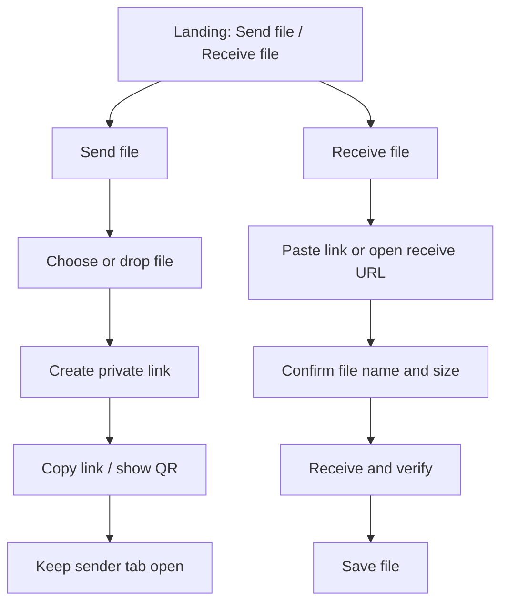

# PonsWarp Grid Public UI Concept

Status: Draft visual handoff
Last updated: 2026-07-06

## Decision

The public web UI should collapse to two primary actions:

1. **Send file**
2. **Receive file**

Everything else is either contextual help, progressive disclosure, or hidden diagnostics.

## User-facing structure



## Desktop layout

- Full-width hero: “Send files directly.”
- Two large cards:
  - Left: Send file
  - Right: Receive file
- Animated background: abstract file beams between two devices.
- Small trust strip below cards:
  - No server upload
  - Verified transfer
  - Private link
  - Keep sender online

## Mobile layout

- Same content stacked vertically.
- If opened through `#/get/<code>`, scroll/focus directly to Receive.
- QR remains optional; copyable link/code remains primary.

## Public copy

### Hero

```text
Send files directly.
Create a private link. Keep your device online. The file moves from sender to receiver.
```

### Send card

```text
Send file
Choose a file and create a private link.

Choose file
Create link
Link ready. Keep this tab open.
```

### Receive card

```text
Receive file
Paste a PonsWarp link or code.

Paste link or code
Find file
Verified. Save file.
```

### Error examples

```text
Ask the sender to reopen the share tab.
This network is blocking direct transfer. Try another network or use CLI.
This link is no longer active. Ask for a new one.
```

## Hidden from default UI

Do not show these by default:

- WebRTC
- ICE
- TURN
- peer IDs
- session IDs
- candidate pairs
- chunk/piece indexes
- hash details
- transport logs
- QA buttons
- coordinator internals

## Image generation prompt

Use this prompt as the visual target for the first concept image:

```text
Design a premium motion-graphics web landing interface for PonsWarp Grid, a direct device-to-device file transfer web app. The interface must show only two primary user actions: “Send file” and “Receive file”. The visual style is calm, futuristic, trustworthy, and extremely approachable for non-technical users. Create a spacious desktop web screen with a deep navy-to-soft-blue gradient background, subtle animated-looking particle trails connecting two abstract devices, glassmorphism cards with large rounded corners, a tactile file drop area, a paste-code receive field, a QR/link preview, friendly transfer progress, and a compact trust strip reading “No server upload”, “Verified transfer”, “Private link”, “Keep sender online”. Hide all developer, WebRTC, ICE, TURN, peer, session, and debug controls. Use clear readable typography, large buttons, accessible contrast, and a refined motion-graphic SaaS aesthetic. The UI should feel as simple as AirDrop plus a private link. Render as a polished product design mockup, 16:9, sharp, legible, correctly spelled short UI text.
```
